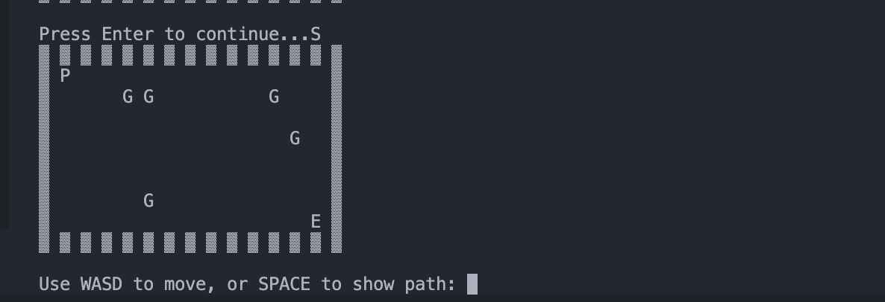

# 🏃‍♂️ Prison Escape Game - BFS Pathfinding

A Python game where you escape from prison using pathfinding algorithms! Navigate through guards and find the optimal path to freedom.



## Features
- 🎮 Interactive grid-based prison environment
- 🔍 BFS (Breadth-First Search) pathfinding visualization
- 🚨 Guard obstacles to avoid
- 🏁 Green exit gate to reach
- 🕹️ Both manual and AI-assisted gameplay

## Requirements
- Python 3.6+
- Pygame library

## Installation
1. Clone this repository:
```bash
git clone https://github.com/mohamed-wa7ba/escape-game.git
cd prison-escape
Install dependencies:

bash

pip install pygame
How to Play
Use arrow keys (↑ ↓ ← →) to move the player (blue square)

Press SPACEBAR to show the optimal escape path (calculated using BFS)

Avoid touching the guards (red squares)

Reach the exit gate (green square) to win

Controls
Key	Action
↑	Move Up
↓	Move Down
←	Move Left
→	Move Right
SPACE	Show BFS Path
Code Structure

prison_escape/
├── main.py
├── README.md
How It Works
The game generates a random prison layout with:

Player starting position (1,1)

Exit position at (GRID_WIDTH-2, GRID_HEIGHT-2)

5 randomly placed guards

BFS Algorithm:

Finds shortest path from player to exit

Avoids walls and guards

Visualizes path with cyan dots when SPACE is pressed

Future Improvements
Add moving guards

Implement A* algorithm option

Add multiple levels

Add timer and scoring system

Improve graphics with sprites

Contributing
Pull requests are welcome! For major changes, please open an issue first to discuss what you'd like to change.

License
MIT

Created by Mohamed Wahba
Feel free to contact me at [mohamed@baianat.com] for questions or suggestions!
